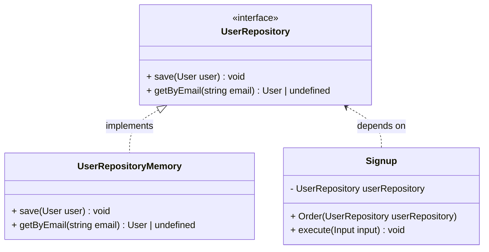
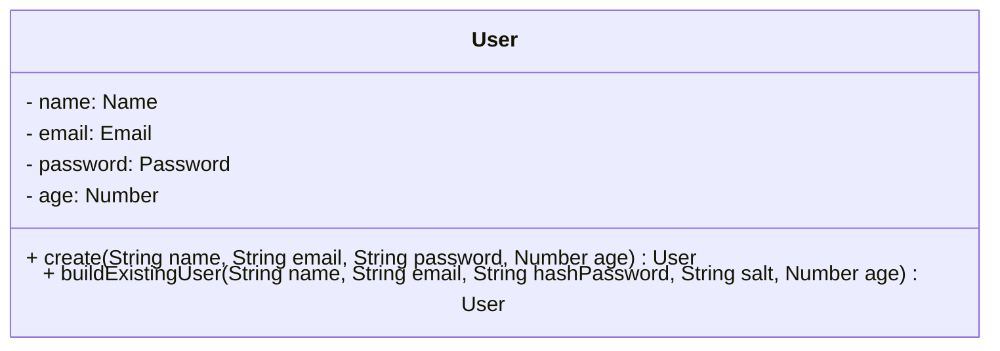
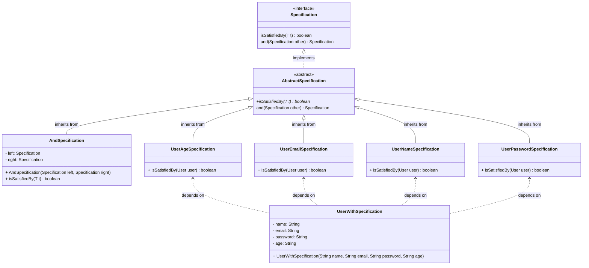

# JWT Auth Using Clean Arch
This simple project has one simple and straightforward objective: To implements JWT authentication using Clean Architecture and some design patterns. Here you'll find how to use JWT authentication in a way that's easy to understand and apply to your software, using the best practices with Clean Arch, TDD and concepts of Domain Driven Design (DDD) such as: Domain Services, Aggregates and Value Objects.


# Table of Contents
- [📝 Requirements](#-requirements)
- [💡 Features](#-features)
- [🚀 How to Run?](#-how-to-run)
    - [🐋 Using Docker](#-using-docker)
    - [💻 Your Local Machine](#-your-local-machine)
- [📝 Patterns and Concepts](#-solid-principles)
    - [Pattern 1](#pattern-1)     
- [⚙️ Made With](#%EF%B8%8F-made-with)
- [🧑🏻‍💻 Author](#-author)

## 📝 Requirements

- [Docker](https://www.docker.com/get-started/)
- [NodeJs](https://nodejs.org/en/download/current)

## 💡 Features
As stated before, this projects aims to help you with JWT authentication, here you'll have 3 common features that every software must have when implementing JWT:
- You can create a user;
- You may login with the user;
- You may check and get user e-mail from JWT token.

## 🚀 How to Run?

You have 2 options to run this project, as it has no common entrypoint such as HTTP endpoint or a index file, you'll need to run the tests.

### 🐋 Using Docker:
Simply run:
```console
foo@bar:~$ docker-compose up
```
The docker console will be attached to your terminal, in case you wanna access the bash to run some command (or erase the node_modules or dist folders) run the command `docker-compose exec app bash`.

### 💻 Your local machine:
First of all, you need to install the dependencies:
```console
foo@bar:~$ npm install
```
Run the command bellow, the tests will be attached to your terminal for you to have a real time feedback about the success of the tests:
```console
foo@bar:~$ npm test
```

## How to Test?
You can test running:
```console
foo@bar:~$ npm test
```
It is worth to emphasize that the tests are running with `--watchAll` flag, so you don't need to run the testes every time.

## 📝 Clean Architecture, Concepts of DDD and Patterns
This project is based on Clean Arch with some concepts of Domain Driven Design (DDD), it also implements some famous patterns, whether to solve a problem or only for demonstration (i.e in the case of Specification Pattern you'll see below). In this section you can see how everything is organized.

### Clean Architecture
We're using Clean Arch to organize this project with this concepts, here you'll have some of the layers implemented, such as:
- Application Layer;
- Enterprise (or Domain) Layer;
- Frameworks and Drivers (or Infrastructure) Layer.

#### Application Layer:
Here we have the usecases and repositories, they are the epicenter of our software, here is where the entities and repositories should be used, the usecases contain more complex business rules and orchestrate the input received by Infrastructure Layer, persists and executes Application Business Rules. In this project we have the following usecase:
- `CheckAuth:` With this usecase you're able to get the user key used when the JWT token is generated (the key is the user email), so if an email is returned successfully, then the user has a valid token;
- `Login:` Deals with user's sessions, by generating and handling JWT tokens;
- `Signup:` Responsible to "create" a user with its data, making possible to the user to access the software.

Here also exists the `UserRepository` interface that makes a dependency inversion some usecases.

#### Enterprise/Domain Layer:
Domain layer holds the entities, repositories, services and/or another domain objects, whose contains business rules. Listed below you'll see what this project has in this layer:
- `Entities:` Here we have the entities containing enterprise business rules, such as `User`, `Email`, `Password`, etc... As you can see, some of the entities are Value Objects;
- `Service:` Exists a Domain Service called `TokenGenerator` whose is used by usecases to generate user's JWT token;
- `Specification:` Only and example of how to use Specification Pattern to apply complex business rules, these rules were refactored to Value Objects, but the Specification was kept as a simple example.

#### Frameworks & Drivers (or Infrastructure) Layer:
In this layer we simply have the implementation of the `UserRepository` called `UserRepositoryMemo`, that mocks the behavior of a database. This layer can has several types of resources, such as database connection, a language framework, UI, etc...

### A Taste of DDD:
Some concepts of Domain Driven Design were implemented in this project, this section is focused on exaplaining them but, what is DDD by the way? It's an approach to software development that focuses on understanding the domain and applying it in the software. 

#### Value Objects:
A Value Object is a type of object that is defined solely by its value and is immutable as we will see, this project has the following Value Objects:
- `Email:` This class validates if an email is valid and holds an email address, it is used by `User` entity;
- `Name:` This class validates if a name has at least two names (name and surname) and holds user's name, it is used by `User` entity;
- `Password:` This class validate, create and holds user's password, it is used by `User` entity.

As you can see, the classes above are quite simple and don't carry a lot of business logics such as entities or uses cases, they're simple and straightforward.

#### Entity:
Entity is a domain object that is defined by its characteristics, such as: Indentity, Lifecycle, Mutability, Equality and Behavior. This system has the `User` class which is and entity with some behaviours and more complex details than a Value Object.

#### Domain Service:
A Domain Service encapsulates domain logic that's not attrubuted to a single entity, it orchestrates complex business processes envolving different entities. Here you'll see only the `TokenGenerator` service, which business logic didn't fit into any entity, so it was separated inside a service class that uses `User` class.

### Some of Patterns Applied:
Here you'll see some of the patterns applied in this project, they can work with DDD, Clean Architecture or alone in another architecture.

#### Repository:
Repository pattern is a pattern that provides a way to manage de data access in a centralized location. It fetches the data into a database, API or other persistence places and maps it to the entity.

An example of repository and its implementation are both the interface `UserRepository` in application layer and the concrete class `UserRepositoryMemory` in infra layer. The `UserRepositoryMemory` is just an in memory implementation of a repository, here we would have the implementation logic of a database connection with its queries or API calls. As always, there's a class that "uses" the repository interface via independence inversion, these classes are the `SignUp` and `Login` usecases. Below we can see an diagram with this pattern:

```
#### Static Factory Method:
There's some implementation of factories in this project, but we will focus on `User` class, where it has a private constructor and the only way to create an instance is using one of its factory methods `create()` or `buildExistingUser()`. This pattern name is self explanatory, we have a static method in the class that create the method for us. 

As you can see, the properties name, email and password are value objects we talked about earlier.

#### Specification:
Only as demonstration, we've created the specification pattern before using the value objects. This pattern is usefull when we have  complex rules to be recombined by chaining together business logic, it can be implemented in scenarios where we have a lot of different rules, such as law rules or taxes rules.


As you can see, in the `UserWithSpecification` we should instantiate the specification classes and chain an instance to another, in order to validate using the abstraction of `Specification`.
## ⚙️ Made With:

- TypeScript 5.3.3
- NodeJS 18.18.2
- Jest 29.7.0
- Docker 24.0.7
- Docker Compose 1.29.2

## 🧑🏻‍💻 Author

_Matheus Oliveira da Silva_ - [Github](https://github.com/matheusolivesilva) | [Linkedin](https://www.linkedin.com/in/matheusoliveirasilva/)
